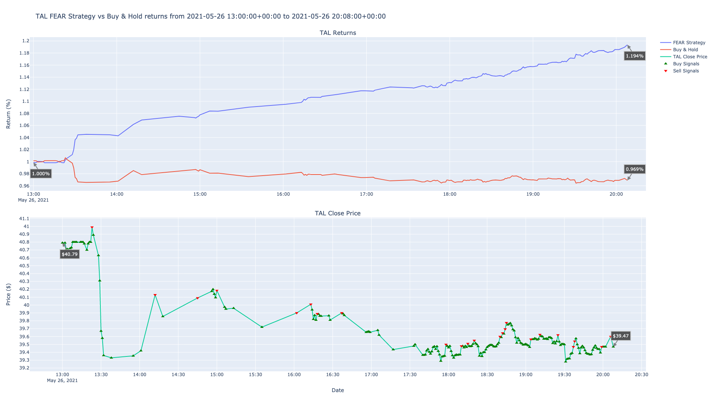

# FEAR - Feature Engineered Augumented Returns

FEAR is an algorithmic trading project that uses a multivariate deep neural network to predict stock price direction. It uses

- momentum
- RSI
- distance
- volatility
- volume
- public sentiment (in progress)

as deciding factors when creating a prediction. This is still very much a work in progress, and right now only can be used for backtesting on past data.

## Sample

Running the program for a ticker would give me an output like this. The return (buy & hold) vs strategy (FEAR) is presented clearly at the bottom.

```
[channels.alpaca] INFO 2021-05-26 20:20:34,410 Fetched 3328 bars for 'iht' from 2021-05-16T20:20:34Z to 2021-05-26T20:20:34Z with freq TimeFrame.Minute
[dnn] INFO 2021-05-26 20:20:34,411 Train: 2021-05-17 08:08:00+00:00 - 2021-05-25 16:56:00+00:00 (2961, 29)
[dnn] INFO 2021-05-26 20:20:34,411 Test: 2021-05-25 16:57:00+00:00 - 2021-05-26 20:17:00+00:00 (367, 29)
[dnn] INFO 2021-05-26 20:20:34,630 Building model using features ['return', 'lag_2', 'lag_5', 'volatility', '14 period RSI', 'lag_3', 'momentum', 'lag_1', 'distance', 'lag_4']
[dnn] INFO 2021-05-26 20:20:36,224 Training model on 2757 records
87/87 [==============================] - 0s 464us/step - loss: 2.3911 - accuracy: 0.7156
[dnn] INFO 2021-05-26 20:20:38,823 Trades made: 163
[dnn] INFO 2021-05-26 20:20:38,827 Returns [iht]:
                            return  strategy
timestamp                                   
2021-05-26 20:17:00+00:00  1.07563  1.605823
```

Because FEAR profits off market volatility, FEAR works well for both losing and gaining stocks.

### Gaining


### Losing



### Crypto

This same strategy works for cryptocurrency as well, as you can see below.


## Table of Contents

- [FEAR - Feature Engineered Augumented Returns](#fear---feature-engineered-augumented-returns)
  - [Sample](#sample)
    - [Gaining](#gaining)
    - [Losing](#losing)
    - [Crypto](#crypto)
  - [Table of Contents](#table-of-contents)
  - [Installation](#installation)
  - [Usage](#usage)
  - [Development](#development)
    - [Sponsor](#sponsor)
    - [Adding new features or fixing bugs](#adding-new-features-or-fixing-bugs)
  - [License](#license)

## Installation

[(Back to top)](#table-of-contents)

```bash
$ git clone https://github.com/ckinateder/fear.git
```

## Usage

[(Back to top)](#table-of-contents)

Right now, it isn't much of an application as it is a developing playground, but you can run it with

```bash
(fear)$ python3 src/app.py
```

## Development

[(Back to top)](#table-of-contents)

FEAR has a sandbox set up for developing trading strategies. At its base level, you can create a strategy with a few simple. First, add a new class to the `strategies.py` file and inherit the `cyclers.BaseCycler` class. Don't forget to call `super` to initialize the parent. Implement the following methods:

```python
# primary
@abstractmethod
def cycle_train(self, symbol: str, period: timedelta = timedelta(minutes=30)):
  """Cycles training the prediction model"""

@abstractmethod
def cycle_trades(self, symbol: str):
  """Cycle the trading/deciding"""

# secondary
@abstractmethod
def build_models(self, data):
  """Build models used"""

@abstractmethod
def train_models(self, data):
  """Train models used"""

@abstractmethod
def get_data(self, symbol: str, **kwargs):
  """This could be pulling and processing from the database, or pulling from a server"""

@abstractmethod
def get_signal(self, datà):
  """Given data, process and generate a signal from the model"""

@abstractmethod
def submit_limit_order(self, symbol: str, side: str, price: float, qty: int = 1):
  """Submit order"""
```

This way, you can call `<your strategy name>.cycle(<symbol>, <search term>)` to run everything. I'll post a sample strategy as well.

### Sponsor

[(Back to top)](#table-of-contents)

<!-- Your project is gaining traction and it is being used by thousands of people(***with this README there will be even more***). Now it would be a good time to look for people or organisations to sponsor your project. This could be because you are not generating any revenue from your project and you require money for keeping the project alive.

You could add how people can sponsor your project in this section. Add your patreon or GitHub sponsor link here for easy access.

A good idea is to also display the sponsors with their organisation logos or badges to show them your love!(*Someday I will get a sponsor and I can show my love*) -->

### Adding new features or fixing bugs

[(Back to top)](#table-of-contents)

<!-- This is to give people an idea how they can raise issues or feature requests in your projects. 

You could also give guidelines for submitting and issue or a pull request to your project.

Personally and by standard, you should use a [issue template](https://github.com/navendu-pottekkat/nsfw-filter/blob/master/ISSUE_TEMPLATE.md) and a [pull request template](https://github.com/navendu-pottekkat/nsfw-filter/blob/master/PULL_REQ_TEMPLATE.md)(click for examples) so that when a user opens a new issue they could easily format it as per your project guidelines.

You could also add contact details for people to get in touch with you regarding your project. -->

## License

[(Back to top)](#table-of-contents)

[GNU General Public License version 3](https://opensource.org/licenses/GPL-3.0)
